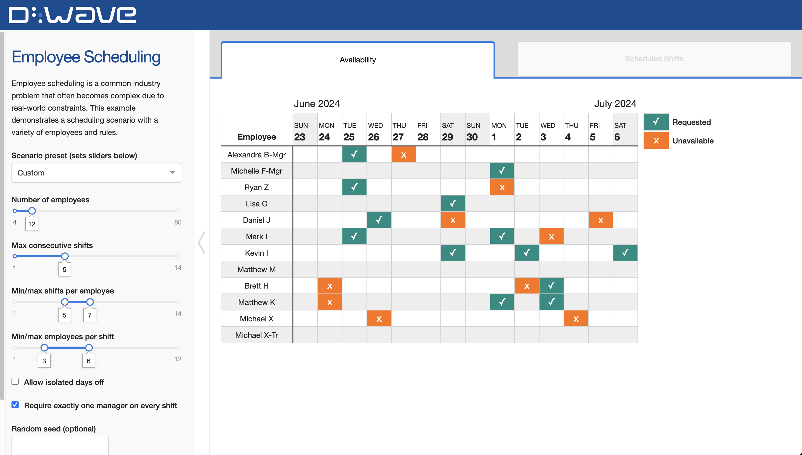

<!--  -->

# Employee Scheduling

Employee scheduling is a common industry problem that often becomes complex
due to real-world constraints. This example demonstrates
a scheduling scenario with a variety of employees and rules.

## Installation

You can run this example without installation in cloud-based IDEs that support
the [Development Containers specification](https://containers.dev/supporting)
(aka "devcontainers").

For development environments that do not support ``devcontainers``, install
requirements:

    pip install -r requirements.txt

If you are cloning the repo to your local system, working in a
[virtual environment](https://docs.python.org/3/library/venv.html) is
recommended.

## Usage

Your development environment should be configured to
[access Leap’s Solvers](https://docs.ocean.dwavesys.com/en/stable/overview/sapi.html).
You can see information about supported IDEs and authorizing access to your
Leap account [here](https://docs.dwavesys.com/docs/latest/doc_leap_dev_env.html).

To run the demo, type the ``python app.py`` command into your terminal and then open a web browser
to the URL printed to the terminal.

Set any of the input options to configure the problem and then click the "Solve"
button.

### Introducing the Demo

The employee availability chart shows employee shift preferences and unavailable
days (PTO). Requested shifts are in teal and marked with a '✓', while
unavailable shifts are in orange and marked with an 'x'.

In the chart, there are three different types of employees.

- Managers: These are employees with 'Mgr' at the end of their name.
- Employees: These are employees with no tag at the end of their name.
- Trainees: These are employees with 'Tr' at the end of their name. The trainee
  has the same name as their trainer. The trainee can **only** be scheduled to
  work on a shift that their trainer is also scheduled to work.

The chart displays employee preferences and availability over two weeks. It will
always display two weeks starting two Sundays from now, with one column for each day of the two week period.

### Inputs

The scenario preset auto-populates all settings with scenarios of varying
sizes. If 'Custom' is selected, the following settings become available:

- Number of employees: Schedules always include 2 managers and 1 trainee.
- Max consecutive shifts: The maximum number of consecutive shifts an employee
  can be scheduled before a day off must be scheduled.
- Min/max shifts per employee: This range determines the number of shifts an
  employee can work.
- Min/max employees per shift: This range determines how many employees need
  to be assigned to each shift.
- Allow isolated days off: If unchecked, employees must be
  scheduled for at least two consecutive days off between work days.
- Require a manager on every shift: If checked, every shift
  must have exactly one manager on duty to supervise.
- Random seed (optional): If set with an integer, it will ensure consistency
between subsequent runs of the same example.

### Outputs

Once the problem has completed, the best solution returned is displayed in
the "Scheduled Shifts" tab.

The solution returned is either the best feasible solution (if a feasible
solution is found) or the best infeasible solution (if no feasible solution is
found). If an infeasible solution is found, a collapsible error bar will show
on the right side of the demo with more information about what makes the solution
infeasible.
