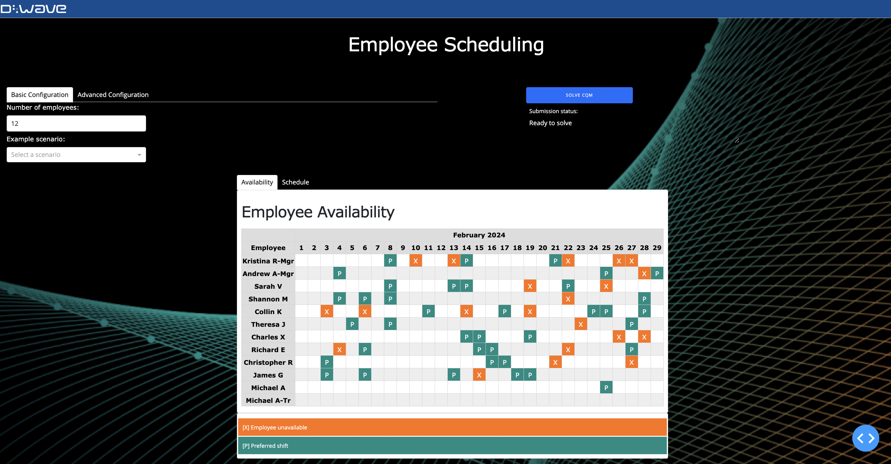

<!--  -->

# Employee Scheduling

Employee scheduling is a common industry problem that often becomes complex
due to real-world constraints. This example demonstrates
a scheduling scenario with a variety of employees and rules.

## Installation

You can run this example without installation in cloud-based IDEs that support 
the [Development Containers specification](https://containers.dev/supporting)
(aka "devcontainers").

For development environments that do not support ``devcontainers``, install 
requirements:

    pip install -r requirements.txt

If you are cloning the repo to your local system, working in a 
[virtual environment](https://docs.python.org/3/library/venv.html) is 
recommended.

## Usage

Your development environment should be configured to 
[access Leap’s Solvers](https://docs.ocean.dwavesys.com/en/stable/overview/sapi.html).
You can see information about supported IDEs and authorizing access to your 
Leap account [here](https://docs.dwavesys.com/docs/latest/doc_leap_dev_env.html).  

To run the demo, type the ``python app.py`` command into your terminal and then open a web browser
to the URL printed to the terminal.

Set any of the input options to configure the problem and then click the "Solve CQM"
button. While the problem is being solved, you can see status updates in the terminal.

### Inputs
Input options under the Basic tab are as follows:

- Number of employees: Schedules always include 2 managers  and 1 trainee.
- Random seed: Optional; use if you want consistency between subsequent runs of the example.
- Example scenario: Auto-populates all settings with scenarios of varying
  sizes that produce feasible solutions.

Additional input options under the More Options tab are as follows:

- Allow isolated days off: Unchecked, this option means that employees are
  scheduled at least two consecutive days off between work days. 
- Require a manager on every shift: Checked, this option means that every shift
  must have exactly one manager on duty to supervise.
- Min/max shifts per employee: The range you set determines the number of shifts an
  employee can work in the month.
- Min/max employees per shift: The range you set determines how many employees need
  to be assigned to each shift.
- Max consecutive shifts: The maximum number of consecutive shifts an employee
  can be scheduled before a day off must be scheduled.

### Outputs

Once the problem has completed, the best solution returned is displayed in
place of "Employee Availability". Click back to "Employee Availability" using
the tabs at the top of the schedule card.

The solution returned is either the best feasible solution (if a feasible
solution is found) or the best infeasible solution (if no feasible solution is
found). If an infeasible solution is found, scrolling down shows the list of
constraints that were violated.

## Introducing the Demo

The employee availability chart shows employee shift preferences and unavailable
days (PTO). Preferred shifts are in teal and marked with a 'P', while
unavailable shifts are in orange and marked with an 'X'.

In the chart, there are three different types of employees.

- Managers: These are employees with 'Mgr' at the end of their name.
- Employees: These are employees with no tag at the end of their name.
- Trainees: These are employees with 'Tr' at the end of their name. The trainee
  has the same name as their trainer. The trainee can **only** be scheduled to
  work on a shift that their trainer is also scheduled to work.

The chart displays employee preferences and availability for this month. It will
always display the current month, with one column for each day in this current
month.

### Options

Always available are three options.

<<<<<<< HEAD
<<<<<<< HEAD

=======
 - Number of employees: Pretty self-explanatory. We will always have 2 managers and 1 trainee.
 - Random seed: Optional; included for consistency when giving live demos.
 - Autofill scenario: Auto-populates all settings to provide scenarios of varying sizes that will produce feasible solutions.
=======
- Number of employees: Pretty self-explanatory. We will always have 2 managers
  and 1 trainee.
- Random seed: Optional; included for consistency when giving live demos.
- Autofill scenario: Auto-populates all settings to provide scenarios of varying
  sizes that will produce feasible solutions.
>>>>>>> a4d0bd4 (Update README)

There is also a collapsible menu of additional options. These additional options
include:

<<<<<<< HEAD
 - Allow isolated days off: Unchecked, this option means that no employee can have a stand-alone day off. Every day off must be at least two consecutive days.
 - Require a manager on every shift: Checked, this option means that every shift must have exactly one manager on duty to supervise.
 - Min/max shifts per employee: The range that determines the number of shifts an employee can work in the month.
 - Min/max employees per shift: The range that determines how many employees need to be assigned to each shift.
 - Max consecutive shifts: The maximum number of shifts in a row that an employee can be scheduled before they need to have a day off.

## Running the Demo

To run the demo, open your terminal and run `python app.py`. Open a web browser and copy the URL from your terminal to load the demo in the browser.

Once you have set all of the options to your satisfaction, click the "Solve CQM" button on the left. In your terminal you will see status updates for "Building CQM..." and "Submitting CQM...".

Once the problem has completed, the best solution returned will be displayed in place of "Employee Availability". You can click back to the original availability using the tabs at the top of the schedule card.

<<<<<<< HEAD
The solution returned will be either the best feasible solution (if a feasible solution is found) or the best infeasible solution (if no feasible solution is found).
>>>>>>> 8a73d61 (Add README)
=======
The solution returned will be either the best feasible solution (if a feasible solution is found) or the best infeasible solution (if no feasible solution is found). If an infeasible solution is found, scrolling down will show the list of constraints that were violated.
>>>>>>> 20381a0 (Adjust packages)
=======
- Allow isolated days off: Unchecked, this option means that no employee can
  have a stand-alone day off. Every day off must be at least two consecutive
  days.
- Require a manager on every shift: Checked, this option means that every shift
  must have exactly one manager on duty to supervise.
- Min/max shifts per employee: The range that determines the number of shifts an
  employee can work in the month.
- Min/max employees per shift: The range that determines how many employees need
  to be assigned to each shift.
- Max consecutive shifts: The maximum number of shifts in a row that an employee
  can be scheduled before they need to have a day off.
>>>>>>> a4d0bd4 (Update README)
